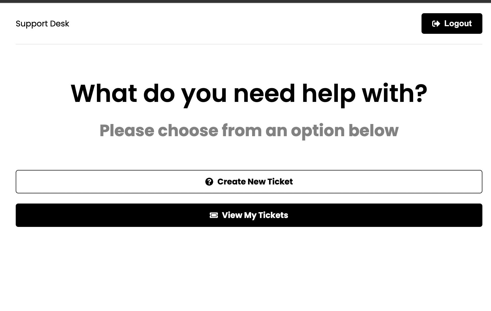

# Support Desk (MERN)

> Support ticket application built with the MERN stack

### [Demo](https://support-desk-mern-ab.herokuapp.com/)


## Usage

### Set Environment Variables

Rename the .env.example to .env and add your [MongoDB](https://www.mongodb.com/) database URI and your JWT secret

### Install backend dependencies

```bash
npm install
```

### Install client dependencies

```bash
cd frontend
npm install
```

### Run app in development (frontend & backend)

```bash
npm run dev